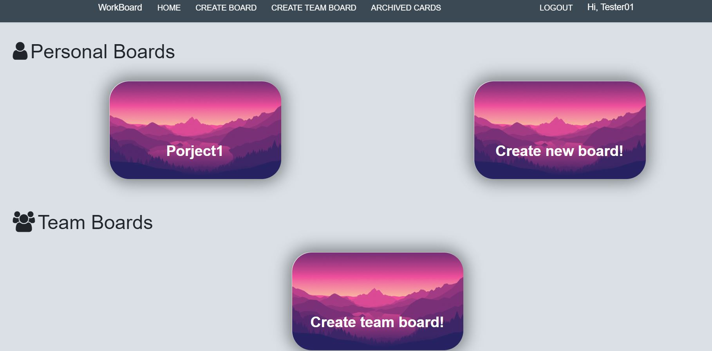
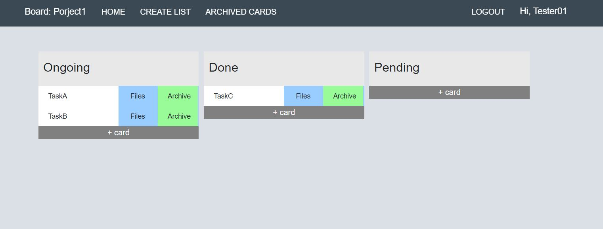
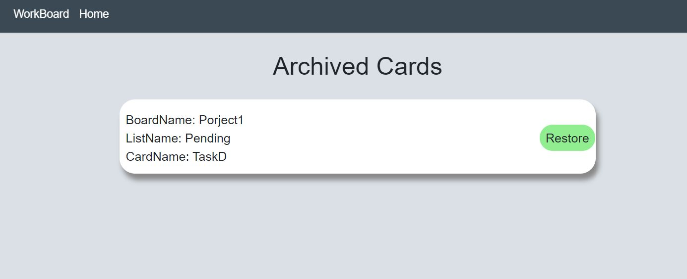
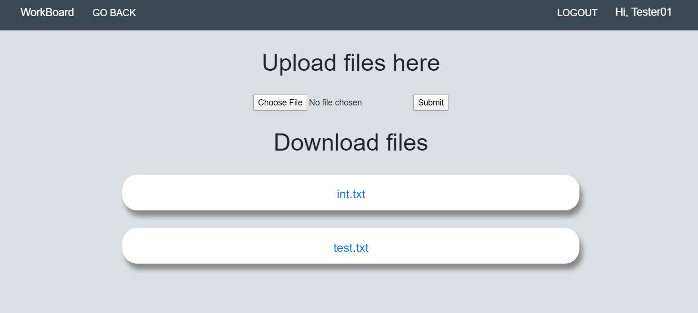

# Workboard Manager

Workboard Manager is a platform that tells you what's being worked on, who's working on what, and where something is in a process.
Its like a white board, filled with lists of sticky notes, with each note as a task for you and your team.







## Setup
```bash
git clone https://github.com/nikhil6418/workBoard
npm install
npm start
```
## Demo
[DEMO LINK](https://workboard2021.herokuapp.com/)


